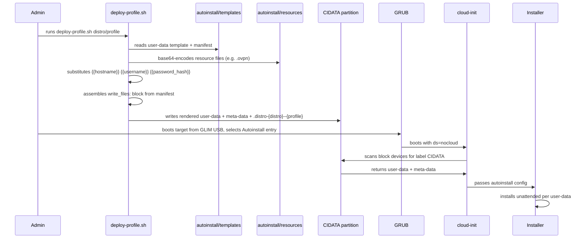

# Cloud-init Autoinstall Support

Boot from a GLIM USB into a fully automated, role-specific installation — no interaction required.

## Distro Status

| Distro | Installer | Mechanism | Status | Notes |
|--------|-----------|-----------|--------|-------|
| Ubuntu | subiquity | cloud-init NoCloud (CIDATA) | ✅ Supported | [Details](#ubuntu) |
| Kubuntu | subiquity | cloud-init NoCloud (CIDATA) | ⏳ Not yet investigated | Ubuntu-based; expected to work |
| KDE neon | Calamares | — | ❌ Not feasible | [Details](#kde-neon) |
| Debian | debian-installer | preseed | ⏳ Not yet investigated | — |
| Fedora | Anaconda | Kickstart | ⏳ Not yet investigated | — |
| Kali | debian-installer / calamares | — | ⏳ Not yet investigated | — |
| Manjaro | Calamares | — | ⏳ Not yet investigated | — |

## How It Works

Ubuntu's [autoinstall](https://ubuntu.com/server/docs/install/autoinstall) system (subiquity + cloud-init) reads a `user-data` configuration file before the installer starts. GLIM passes `ds=nocloud` on the kernel cmdline; cloud-init auto-detects any partition labelled `CIDATA` and reads `user-data` + `meta-data` from its root.

The CIDATA partition is created by `glim-partition.sh --cidata` as a small (16 MiB) FAT16 partition on the GLIM USB. Before deploying to a machine, run `deploy-profile.sh` to render the chosen profile template and write the seed files to that partition.



## USB Layout

```
<GLIM partition>/
├── boot/
│   └── iso/
│       └── ubuntu/
│           └── ubuntu-*.iso
├── autoinstall/
│   ├── templates/
│   │   └── {distro}/
│   │       └── {profile}/
│   │           ├── user-data    ← template with {{placeholders}} + # __RESOURCES__ sentinel
│   │           ├── meta-data
│   │           └── manifest     ← lists resource files to embed
│   └── resources/
│       └── vpn/
│           ├── corp-vpn-uk.ovpn    ← admin-supplied, not in git
│           └── corp-vpn-us.ovpn
└── deploy-profile.sh

[CIDATA partition — FAT16, 16 MiB]
├── user-data                          ← rendered profile (written by deploy-profile.sh)
├── meta-data
└── .distro-{distro}--{profile}        ← marker: distro + profile + deploy timestamp
```

`autoinstall/templates/` is the source of truth for profile templates.
`autoinstall/resources/` holds admin-supplied artifacts (VPN configs, certs, etc.) — these are **not tracked by git** and must be placed on the USB stick manually.

## GRUB Menu

For each supported distro ISO, GLIM generates up to three entries. The two autoinstall entries only appear when a `.distro-{distro}--{profile}` marker is present on the CIDATA partition — written by `deploy-profile.sh`. The active profile name is shown in the menu.

```
Ubuntu 24.04 amd64 desktop
Ubuntu 24.04 amd64 desktop — Autoinstall (software-engineer)
Ubuntu 24.04 amd64 desktop — Autoinstall (software-engineer) Unattended
```

| Entry | Behaviour |
|-------|-----------|
| Live | `cloud-init=disabled` — full live session, CIDATA ignored |
| Autoinstall | Installer UI pre-filled from CIDATA; confirm each step before proceeding |
| Autoinstall Unattended | Fully automatic, no interaction |

USB sticks without a CIDATA partition (or without a distro marker) show only the live entry — identical to stock GLIM.

## Template Files

### `meta-data`

Required by cloud-init but can be minimal — the same file is shared across all profiles:

```yaml
instance-id: glim-autoinstall
```

### `user-data`

A standard cloud-init NoCloud document with:

- `{{hostname}}`, `{{username}}`, `{{password_hash}}` — substituted at deploy time
- A `# __RESOURCES__` sentinel line at the top level — replaced by a `write_files:` block assembled from the manifest

```yaml
#cloud-config
autoinstall:
  version: 1
  identity:
    hostname: "{{hostname}}"
    username: "{{username}}"
    password: "{{password_hash}}"
  packages:
    - ...
  late-commands:
    - ...

# __RESOURCES__
```

### `manifest`

Lists resource files to embed into the rendered `user-data` as a cloud-init `write_files:` block. One directive per line; `#` comments are supported.

```
# directive  source (relative to autoinstall/resources/)  dest-on-target                          mode  owner
embed        vpn/corp-vpn-uk.ovpn                        /etc/openvpn/client/corp-vpn-uk.ovpn  0600  root:root
embed        vpn/corp-vpn-us.ovpn                        /etc/openvpn/client/corp-vpn-us.ovpn  0600  root:root
```

`mode` and `owner` are optional — defaults are `0644` and `root:root`.

At deploy time, `deploy-profile.sh` base64-encodes each listed resource and replaces `# __RESOURCES__` with a `write_files:` block. Cloud-init writes the files to the installed system on first boot, before any user services start.

## Deploying to Hardware

### Prerequisites

The GLIM USB must have been partitioned with `--cidata`:

```bash
./glim-partition.sh /dev/sdX --gpt --cidata
```

Resource files referenced by manifests must be present on the USB stick under `autoinstall/resources/` before running `deploy-profile.sh`. They are not synced by `glim.sh` — copy them manually:

```bash
cp /path/to/corp-vpn-uk.ovpn /media/$USER/GLIM/autoinstall/resources/vpn/
cp /path/to/corp-vpn-us.ovpn /media/$USER/GLIM/autoinstall/resources/vpn/
```

### Activating a Profile

Run `deploy-profile.sh` from the mounted USB stick. It prompts for hostname, username, and password, hashes the password with SHA-512, embeds resources, and writes the rendered seed files plus a distro marker to the CIDATA partition:

```bash
# Auto-detects the mounted CIDATA partition:
./deploy-profile.sh

# Or specify profile and/or CIDATA mount point explicitly:
./deploy-profile.sh ubuntu/software-engineer
./deploy-profile.sh ubuntu/software-engineer --cidata-dir /media/$USER/CIDATA
```

The marker file (`.distro-{distro}--{profile}`) written to CIDATA records the distro, profile name, and deployment timestamp. To inspect it:

```bash
cat /media/$USER/CIDATA/.distro-ubuntu--software-engineer
# distro=ubuntu
# profile=software-engineer
# deployed=2026-05-14T21:30:00+01:00
```

`deploy-profile.sh` is copied to the GLIM partition root by `glim.sh`, so it is available directly from the mounted USB stick without a separate checkout.

Boot the target machine from the GLIM USB and select the appropriate Autoinstall entry. To switch profiles, re-run `deploy-profile.sh` and reboot.

## Adding a Profile

1. Create the template directory in the repo:

   ```
   autoinstall/templates/{distro}/my-new-role/user-data
   autoinstall/templates/{distro}/my-new-role/meta-data
   autoinstall/templates/{distro}/my-new-role/manifest   ← optional, omit if no resource embeds needed
   ```

2. Add the profile name to `autoinstall_profiles` in the relevant `grub2/inc-{distro}.cfg`:

   ```bash
   set autoinstall_profiles="... my-new-role"
   ```

3. Run `glim.sh` to sync the new template to the USB stick.

4. Run `deploy-profile.sh {distro}/my-new-role` to activate it on CIDATA before booting.

---

## Per-distro Details

### Ubuntu

**Installer:** subiquity  
**Status:** ✅ Supported

Ubuntu Desktop 23.04+ ships subiquity with cloud-init autoinstall support. The NoCloud datasource auto-discovers the CIDATA partition by label — no additional kernel cmdline is required beyond `ds=nocloud`.

#### GRUB entries

```
Ubuntu 24.04 amd64 desktop
Ubuntu 24.04 amd64 desktop — Autoinstall (software-engineer)
Ubuntu 24.04 amd64 desktop — Autoinstall (software-engineer) Unattended
```

The live entry passes `cloud-init=disabled` to prevent CIDATA from being picked up automatically in a normal live session.

#### Internet connectivity

**Internet access is required before installation begins** — both the `packages:` section (apt) and `late-commands` (Docker CE, Chrome, VPN packages, etc.) need it.

The first `early-command` probes `1.1.1.1:53` before partitioning starts and retries every 10 seconds for up to 5 minutes, printing a clear message to the console on each attempt:

```
Checking internet connectivity...
  No connection yet — connect an ethernet cable. Retrying in 10 s (1/30)...
  No connection yet — connect an ethernet cable. Retrying in 10 s (2/30)...
Internet connection confirmed.
```

If no connection is established within 5 minutes, the install aborts before partitioning with a clear error rather than failing mid-way through package installation. Re-run the install after connecting.

**Recommendation:** connect via ethernet with DHCP before booting. WiFi also works if already configured in the live environment, but credentials cannot be passed via autoinstall without additional configuration.

> **"Preparing Ubuntu…" appears stuck?**
> This is normal if there is no internet connection at boot time. The installer is waiting for the connectivity check to either succeed or time out (up to 5 minutes). To see what is happening, switch to a console with **Ctrl+Alt+F2** — the retry messages above will be visible there. Connect ethernet (or WiFi) and the check will detect it automatically; the install will then proceed without any further intervention. If you know there is no internet and want to abort immediately, switch to the console and kill the check process, then reboot with a connection ready.

#### Profiles

| Profile | Description |
|---------|-------------|
| `software-engineer` | Docker CE, Google Chrome, Homebrew, OpenVPN (corporate UK/US) |

#### Compatibility

- Requires Ubuntu **20.04 or later** (subiquity installer).
- Does not apply to Ubuntu flavours using the debian-installer (older ISOs).
- Tested with `ubuntu-*-desktop-amd64.iso` naming convention matched by `inc-ubuntu.cfg`.

---

### KDE neon

**Installer:** Calamares  
**Status:** ❌ Not feasible  
**Investigated:** 2026-05-15

KDE neon ISOs ship Calamares as the installer, not subiquity. The cloud-init NoCloud autoinstall mechanism is subiquity-specific and does not apply.

| Question | Finding |
|----------|---------|
| Subiquity on KDE neon ISOs? | No — Calamares only. |
| Calamares unattended mode? | No. CLI flags `-d`/`-D`/`-X` are developer debug only. No answer-file format, no NoCloud source, no ISO scan path for unattended config. `/etc/calamares/*.conf` sets module defaults, not user choices (partition target, user, password, timezone). |
| Kernel cmdline preseed? | Casper params (`preseed/file=`, `boot=casper`) preseed the *live session* via debconf — Calamares ignores debconf once launched. |
| Community recipes? | None viable. Only OEM-mode docs (still interactive, just deferred). No working unattended recipe exists publicly. |

**Live boot works.** The `KDE neon >` GRUB entry launches the live environment; users run Calamares manually.

**Alternative:** if KDE Plasma + autoinstall is needed, use **Kubuntu** (Ubuntu-based, ships subiquity) — the existing CIDATA autoinstall pattern works as-is by adding `autoinstall/templates/kubuntu/<profile>/`.
