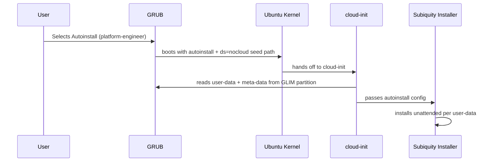

# Ubuntu Autoinstall Profiles

Boot a single Ubuntu ISO into a fully automated, role-specific installation — no interaction required.

## How It Works

Ubuntu's [autoinstall](https://ubuntu.com/server/docs/install/autoinstall) system (subiquity + cloud-init) reads a `user-data` configuration file before the installer starts. GLIM exposes this via the `nocloud` data source: seed files are stored on the GLIM partition itself, referenced by its UUID at boot time.



## USB Layout

```
/boot/iso/ubuntu/
├── ubuntu-24.04-desktop-amd64.iso
└── profiles/
    ├── platform-engineer/
    │   ├── user-data    ← autoinstall cloud-config YAML
    │   └── meta-data    ← required by cloud-init (can be minimal)
    ├── qa-engineer/
    │   ├── user-data
    │   └── meta-data
    └── software-engineer/
        ├── user-data
        └── meta-data
```

## GRUB Menu

For each Ubuntu ISO found, GLIM generates a live-boot entry plus one autoinstall entry per profile whose `user-data` exists:

```
Ubuntu 24.04 amd64 desktop
Ubuntu 24.04 amd64 desktop — Autoinstall (platform-engineer)
Ubuntu 24.04 amd64 desktop — Autoinstall (qa-engineer)
Ubuntu 24.04 amd64 desktop — Autoinstall (software-engineer)
```

Profiles with no `user-data` file are silently skipped. USB sticks without any `profiles/` directory behave identically to stock GLIM.

## Seed Files

### `meta-data`

Required by cloud-init but can be minimal — the same file can be shared across all profiles:

```yaml
instance-id: glim-autoinstall
```

### `user-data`

A standard Ubuntu autoinstall cloud-config document. The key sections for role differentiation are `packages` and `late-commands`.

#### Avoiding Snaps

Ubuntu 22.04+ installs Firefox and some other tools as Snaps by default. To force native `.deb` packages, purge `snapd` and pin the Mozilla PPA in `late-commands`:

```yaml
#cloud-config
autoinstall:
  version: 1
  late-commands:
    - curtin in-target -- apt-get purge -y snapd
    - curtin in-target -- apt-mark hold snapd
    - curtin in-target -- add-apt-repository -y ppa:mozillateam/ppa
    - |
      cat <<EOF | tee /target/etc/apt/preferences.d/mozilla
      Package: firefox*
      Pin: release o=LP-PPA-mozillateam
      Pin-Priority: 1001
      EOF
    - curtin in-target -- apt-get update
    - curtin in-target -- apt-get install -y firefox
```

#### Example: Platform Engineer

```yaml
#cloud-config
autoinstall:
  version: 1
  locale: en_GB.UTF-8
  keyboard:
    layout: gb
  identity:
    hostname: platform-host
    username: engineer
    password: "$6$..."   # generate with: openssl passwd -6
  packages:
    - git
    - curl
    - gpg
  late-commands:
    # Remove Snaps
    - curtin in-target -- apt-get purge -y snapd
    - curtin in-target -- apt-mark hold snapd
    # Docker CE
    - curtin in-target -- install -m 0755 -d /etc/apt/keyrings
    - curtin in-target -- curl -fsSL https://download.docker.com/linux/ubuntu/gpg -o /etc/apt/keyrings/docker.asc
    - curtin in-target -- chmod a+r /etc/apt/keyrings/docker.asc
    - |
      echo "deb [arch=amd64 signed-by=/etc/apt/keyrings/docker.asc] https://download.docker.com/linux/ubuntu $(lsb_release -cs) stable" \
        | tee /target/etc/apt/sources.list.d/docker.list
    - curtin in-target -- apt-get update
    - curtin in-target -- apt-get install -y docker-ce docker-ce-cli containerd.io
```

#### Example: Software Engineer

```yaml
#cloud-config
autoinstall:
  version: 1
  locale: en_GB.UTF-8
  keyboard:
    layout: gb
  identity:
    hostname: dev-host
    username: engineer
    password: "$6$..."
  packages:
    - git
    - build-essential
    - curl
    - wget
    - gpg
  late-commands:
    # Remove Snaps
    - curtin in-target -- apt-get purge -y snapd
    - curtin in-target -- apt-mark hold snapd
    # Native Firefox
    - curtin in-target -- add-apt-repository -y ppa:mozillateam/ppa
    - |
      cat <<EOF | tee /target/etc/apt/preferences.d/mozilla
      Package: firefox*
      Pin: release o=LP-PPA-mozillateam
      Pin-Priority: 1001
      EOF
    - curtin in-target -- apt-get update
    - curtin in-target -- apt-get install -y firefox
    # Native Slack (.deb — check https://slack.com/downloads/linux for latest version)
    - curtin in-target -- wget https://downloads.slack-edge.com/releases/linux/4.41.96/prod/x64/slack-desktop-4.41.96-amd64.deb -O /tmp/slack.deb
    - curtin in-target -- apt-get install -y /tmp/slack.deb
    - curtin in-target -- rm /tmp/slack.deb
```

## Adding a Profile

1. Add the profile name (space-separated) to `autoinstall_profiles` in `grub2/inc-ubuntu.cfg`:

   ```bash
   set autoinstall_profiles="platform-engineer qa-engineer software-engineer my-new-role"
   ```

2. Create the seed directory on the USB stick:

   ```
   /boot/iso/ubuntu/profiles/my-new-role/user-data
   /boot/iso/ubuntu/profiles/my-new-role/meta-data
   ```

The new entry appears in the GRUB menu automatically on next boot.

## Generating a Password Hash

The `identity.password` field requires a SHA-512 hash, not a plaintext password:

```bash
openssl passwd -6
```

## Compatibility

- Requires Ubuntu **20.04 or later** (subiquity installer).
- Does not apply to Ubuntu flavours using the debian-installer (older ISOs).
- Tested with `ubuntu-*-desktop-amd64.iso` naming convention matched by `inc-ubuntu.cfg`.
